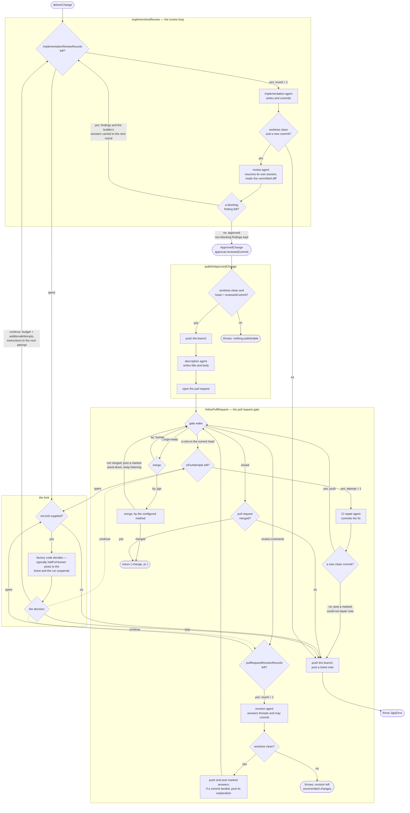

# Delivery from a factory

The optional `/delivery` module implements software changes and follows their
pull requests. **Delivery** is the whole of it: implementation, code review,
publication, pull-request feedback, CI repair, and merge or closure, coordinated
by `deliverChange`. The **review loop** is the narrower thing `implementAndReview`
coordinates: implementation and code review repeated until approval or an
exhausted round budget. Other workflows can use `/agents` without any delivery
concepts. All examples run inside a factory workflow or a replay-safe block.

## The delivery graph

Delivery is a **workflow graph, not a DAG**. Three of its edges run backwards,
and the whole design rests on them: a rejected review returns to implementation,
a granted continuation returns to a phase that had already spent its budget, and
every pull-request wake returns to the gate that produced it. A pull request can
go red, be repaired, be reviewed, be revised, and go red again, all within one
durable run.



The three continuation edges leaving the reply are one edge drawn three times: a
continuation is granted only to the phase that exhausted its own budget.

Reading the graph against the code:

- **The review loop** checks the budget *before* each attempt, so
  `implementationReviewRounds: 0` fails the run without running an
  agent. The implementation agent commits its own work. If it leaves the
  worktree dirty or adds no commit since the base, the delivery preserves the
  branch, posts the ticket note and throws before any review runs — nothing
  uncommitted is ever reviewed.
- **The review blocks on defects, not on preferences.** Each finding is marked
  `blocking` or not: a requirement left unmet, a defect a user could hit or an
  untested risk blocks; naming, structure, comments, extra test cases and
  wording do not. A round with no blocking finding is approved, and its
  remaining observations are appended to the pull request body as reviewer
  notes, so a human still reads them. `blocking` is what the loop acts on, so a
  reviewer that says "approved" while still naming a blocker gets another round.
- **The reviewer remembers its own rounds.** It keeps a harness session across
  rounds exactly as the builder does, under `change.sessions.review`, and a
  resumed reviewer is told only what is new: the current diff and the builder's
  answer to each finding it last raised. The builder answers every finding, and
  may answer one with a reason for not changing it; the reviewer then accepts
  that reason or re-raises the finding as blocking. When a resume fails — which
  is logged, not swallowed — the rebuilt reviewer is given `change.review`, the
  ledger of every earlier round's findings, verdicts and builder answers,
  with the instruction not to re-open a finding it cleared on unchanged code.
- **Approval names a commit.** `approval.reviewedCommit` is the head the
  reviewer judged, and `publishApprovedChange` refuses to publish anything else:
  it throws if the worktree is dirty, and throws if the head has moved off that
  commit. The push step repeats these checks on every retry and pushes the
  approved SHA explicitly. Only an `ApprovedChange` typechecks as its input, so a stopped result
  cannot be published at all.
- **Following the pull request** is one suspended gate per pull request, woken
  by a GitHub webhook or by the service's five-minute nudge. Every wake re-reads
  the whole pull request and says what is outstanding *now*; nothing is
  remembered between wakes, because every comment jigs posts carries a hidden
  marker naming what it answered ([ADR 0009](adr/0009-webhook-ingress-resource-scoped-tokens.md)).
  Feedback that is not a formal review wakes the loop the same way: a review's
  summary body and a comment on the pull request conversation each arrive as a
  single-comment thread in the `review-comments` wake, answered on the
  conversation rather than in a thread reply, so a changes-requested review with
  inline comments is one wake, not two. After a revision, answers are always
  posted, each marked with the comment version it answers; edit that comment and
  it is unanswered again. A separate change-and-validation explanation is posted
  only when the branch head moved during that round, marked with the commit that
  landed; a missing explanation degrades to answers-only rather than ending the
  run. A `ci-red` wake names the current head and is skipped when the worktree
  has already moved past it; a repair that produces no new commit posts a marked
  note saying so, which is what keeps a later run from spending its budget on
  the same failure. `merge-ready` means the configured `merge.approval` signal is
  present, GitHub itself reports the pull request mergeable, CI is green, it is
  not a draft, and no feedback is outstanding; under `merge.by: "human"` it only
  keeps listening. The gate ends when the pull request closes, and under
  `merge.by: "jigs"` it also ends the moment jigs' own merge succeeds —
  `merged` is returned right there, without waiting for the `closed` wake. A
  merge GitHub does not make is reported as a marked comment on the pull
  request, and the gate keeps listening. Whether that comment stands the commit
  down depends on why: a state that passes on its own — a check still running, a
  merge state GitHub has not finished computing, a head that moved — is noted
  once and retried on the next wake, as is an approval that has to be granted
  again, while a conflict, a closed pull request or a refusal the pull request's
  own state does not explain is stood down.
- **Scope names the work.** Every marker carries one, and it is what "already
  done" is measured against. It defaults to the workflow function's own name and
  the task's key, so `shipWorkflow` delivering `AGE-123` writes
  `shipWorkflow/AGE-123`; renaming that function changes the scope, exactly as
  it moves the durable step ids. Pass `scope` to `deliverChange` or
  `followPullRequest` to continue work a differently named workflow started, or
  to review a pull request independently of the run delivering it. Two scopes on
  one pull request never claim each other's answers, and neither reads the
  other's comments as human feedback.
- **An answer is posted where the reviewer is reading.** An inline comment is
  answered in its own thread and nowhere else; an answer naming no thread lands
  on the conversation and claims only what is already on the conversation. An
  answer that claims nothing is still posted, and still marked as jigs'.
- **Post-once.** Each answer is posted at most once, because every wake reads
  GitHub first and the gate only yields what has no marked answer. Nothing is
  re-read before posting. A post that fails ends that wake — the round stops
  there, the run does not fail, and the next wake reposts whatever is still
  unanswered. A reply lost to a transport failure is therefore delayed by at
  most one nudge interval, never dropped and never doubled.
- **A delivery returns only after merge.** Every stop-short path first pushes
  the branch and posts a ticket note, then throws with a message naming the
  branch: an exhausted budget, `onLimit` declining, an unusable CI repair, an
  unreviewable implementation attempt, or a pull request closed unmerged.
  Publication whose head moved off `approval.reviewedCommit`, and a pull-request
  revision that leaves uncommitted changes, also fail rather than returning.

## Merge policy

`followPullRequest` and `deliverChange` take one `merge` value: who merges
(`by`), by which of GitHub's three methods (`method`), and what counts as
consent (`approval`, either an approving review of the current commit or a
named label on the pull request). The factory policy in `jigs.config.ts` is the
default. Each binding may override `by` and `method`; `approval` remains
factory-level because it follows the factory's GitHub identity.
`resolveMergePolicy(binding)` reads the effective factory-then-binding policy.
[setup](setup.md) has the values and how they pair with the GitHub identity
jigs runs as.

Readiness is GitHub's own verdict plus a green build: jigs merges when the
approval signal is present, GitHub reports the pull request mergeable, it is not
a draft, and at least one check has finished and passed. That last condition is
jigs' own, because GitHub calls a repository with no required checks mergeable
with no build at all — so **jigs never merges in a repository with no CI**, and
such a repository wants `merge.by: "human"`. `behind`, `blocked`, `has_hooks`
and `unknown` are all "not yet, ask again". The merge call pins the commit the
wake named, so a push that lands in between is refused rather than merged over;
jigs logs the refusal, posts a marked stand-down, and re-reads the pull request
on the next wake.

## Budgets

The three budgets carry the same names wherever they appear — on
`deliverChange`, on a single phase, on the scaffold workflow's inputs, and in
`change.attempts`.

| Budget | What one unit buys | When it is spent |
| --- | --- | --- |
| `implementationReviewRounds` | One implementation attempt **plus** one review of what that attempt committed | Before publication |
| `ciFixAttempts` | One repair attempt against a red head | After publication |
| `pullRequestRevisionRounds` | One batch of review feedback answered | After publication |

Each budget is spent by its own phase and no other. All three count
cumulatively for the life of the delivery, and counters never reset. Green CI
results consume no repair attempts; the first repair uses attempt one. Zero permits no
attempt in that phase and fails the run the moment that phase has
work to do. Duplicate notifications — a second webhook for a head already
repaired, or a review thread whose only new comment is jigs' own reply — do not
consume a budget.

`DeliveryLimits` bounds what may run; `DeliveryAttempts` counts what did. They
carry the same three names, and reading them together is how a factory sees
where a delivery stands. A granted continuation raises the bound, within the
same durable run, and leaves the count alone: after `onLimit` adds 2 to an
exhausted budget of 5, the change has still made 5 attempts and may now make 7.
`implementAndReview` and `followPullRequest` each take only the budgets their
own phases spend, so a composed delivery cannot hand a phase a budget it has no
use for.

## Where a human grants continuation

There are two paths, and a factory usually wires them into one.

`onLimit` is the mechanism. It is a workflow-side callback, given the
`LimitReached` event — the exhausted phase, the attempts already spent, the
findings that say why the phase is unfinished, the task, the worktree, and the
pull request once one exists. Returning `{ action: "continue", instructions,
additionalAttempts }` adds to that phase's budget and passes `instructions` to
the next attempt and every attempt after it. Returning `{ action: "stop" }`
preserves the branch, posts the ticket note and fails the run.

The **halt-for-human ticket channel** is how a human actually reaches that
callback. `onLimit` runs workflow-side, so it may suspend: the starter factory's
bound `haltForHuman` posts the question as a comment on the run's Linear ticket,
mentioning the ticket's creator and assignee, and suspends the run until a human
replies there. The reply body becomes the continuation's instructions. `jigs ps`
shows a run parked this way, and the operator answers it by replying to the
comment — no separate console, and no second run.

```ts
import type { LimitReached } from "@salimhamed/jigs/delivery";
import type { TicketClaim } from "@salimhamed/jigs/linear";
import { haltForHuman } from "#jigs";

declare const claim: TicketClaim;

const onLimit = async (limit: LimitReached) => {
  const reply = await haltForHuman(claim, {
    headline: `Delivery for ${limit.task.key} has spent its ${limit.phase} budget.`,
    where: "delivery",
    about: limit.task.title,
    notes: [`${limit.attempts} attempt(s) so far.`, ...limit.findings],
    questions: [
      {
        question: "Keep going, or stop here?",
        options: [{ label: "Keep going", recommended: true }, { label: "Stop" }],
      },
    ],
    onReply: "continue",
  });
  if (/^\s*stop\b/i.test(reply.body)) return { action: "stop" as const };
  return { action: "continue" as const, instructions: reply.body, additionalAttempts: 2 };
};
```

Any other channel works the same way: Workflow hooks, a Slack round trip, or a
policy that continues without asking anyone. What matters is that the callback
stays workflow-side. Never send one through a durable step argument, which must
contain data only.

`onLimit` is the only continuation mechanism. A returned terminal result is
useful for inspection; it is not a checkpoint that can restart an interrupted
phase in a new run.

## Choose agents and budgets

Import the bound operation from your generated `jigs.ts`, which every factory
file reaches at the same root-anchored specifier:

```ts
import { claude, codex } from "@salimhamed/jigs/agents";
import { deliverChange, resolveMergePolicy } from "#jigs";

const result = await deliverChange({
  task,
  worktree,
  binding: "application",
  implementation: { harness: codex({ model: "gpt-5.6-sol" }) },
  review: { harness: claude({ model: "opus" }) },
  limits: {
    implementationReviewRounds: 5,
    ciFixAttempts: 3,
    pullRequestRevisionRounds: 4,
  },
  merge: await resolveMergePolicy("application"),
});
```

`ciRepair`, `pullRequestRevision` and `pullRequestDescription` default to the
implementation harness. Configure any of them independently — each takes its own
`{ harness, prompt }`, and `selectHarness` resolves a harness name against the
factory's own per-harness model defaults, so naming one harness never drags the
other's default model along:

```ts
import { claude, codex, selectHarness } from "@salimhamed/jigs/agents";
import { deliverChange, resolveMergePolicy } from "#jigs";

const defaultModels = { claude: "opus", codex: "gpt-5.6-sol" };

const result = await deliverChange({
  task,
  worktree,
  binding: "application",
  implementation: { harness: selectHarness("codex", defaultModels) },
  review: { harness: selectHarness("claude", defaultModels) },
  ciRepair: { harness: codex({ model: "gpt-5.6-sol-codex" }) },
  pullRequestRevision: { harness: claude({ model: "sonnet" }) },
  pullRequestDescription: {
    harness: claude({ model: "haiku" }),
    transform: (description) => ({ ...description, title: `[factory] ${description.title}` }),
  },
  limits: {
    implementationReviewRounds: 5,
    ciFixAttempts: 3,
    pullRequestRevisionRounds: 4,
  },
  merge: await resolveMergePolicy("application"),
});
```

Sessions are kept per role and never passed between incompatible harness
configurations: change a role's harness and its next attempt starts fresh, with
the worktree diff rebuilt into its prompt. The review role keeps its own
session, separate from the implementation one, so a verdict never inherits the
builder's conversation and still remembers what it already judged. A description role's
`transform(description, task)` enforces factory title and body conventions after
the model responds.

## Own the prompts

Each role accepts a `prompt` function receiving a context shaped for that role
alone, and returning a string or a promise of one. The output schema stays owned
by the operation, whatever the prompt says.

| Role | Context | Beyond `task`, `worktree`, `attempt` |
| --- | --- | --- |
| `implementation` | `ImplementationPromptContext` | `findings`, `instructions`, `readDiff?()` |
| `review` | `ReviewPromptContext` | `baseCommit`, `headCommit`, `diff`, `instructions`, `responses`, `ledger?` |
| `ciRepair` | `CiRepairPromptContext` | `failing`, `pr`, `instructions`, `readDiff?()` |
| `pullRequestRevision` | `PullRequestRevisionPromptContext` | `threads`, `reviewBody?`, `pr`, `instructions`, `readDiff?()` |
| `pullRequestDescription` | `DescriptionPromptContext` | `diff` (no `attempt`) |

`readDiff()` is available only for fresh or rebuilt sessions. It reads the diff
when called and reuses that result within the attempt. The default prompt calls
it; a replacement can ignore it. Resumed sessions do not read the diff. Review
and description contexts always contain their required `diff` string, and
`ledger` is present only when the reviewer holds no session to resume.

Every context carries `renderDefaultPrompt()`, which renders what jigs would
have sent for this attempt. Await it to extend the default:

```ts
import { claude } from "@salimhamed/jigs/agents";
import type { ReviewPromptContext } from "@salimhamed/jigs/delivery";

const review = {
  harness: claude({ model: "opus" }),
  prompt: async (context: ReviewPromptContext) =>
    `${await context.renderDefaultPrompt()}

Also check authorization and migration compatibility.`,
};
```

Ignore it and the default is replaced outright — an equally supported use. The
role's own context is what a replacement is written against:

```ts
import { codex } from "@salimhamed/jigs/agents";
import type { ImplementationPromptContext } from "@salimhamed/jigs/delivery";

const implementation = {
  harness: codex({ model: "gpt-5.6-sol" }),
  prompt: (context: ImplementationPromptContext) => `
Round ${context.attempt} on ${context.task.key}: ${context.task.title}

${context.task.instructions}

${context.findings.length > 0 ? `Fix these findings:\n${context.findings.map((f) => f.summary).join("\n")}` : "This is the first round."}
${context.instructions}

Work in ${context.worktree.path}, branched from ${context.worktree.baseSha}.
Run the repository's checks and commit before you finish: only committed work is
reviewed. Do not push and do not open a pull request.
`,
};
```

Nothing is rendered that a role does not use: the default renderer runs inside
`renderDefaultPrompt()` or not at all, so a role that replaces the prompt never
pays for one it discards.

The shipped renderers are exported too, for a role that wants one verbatim with
its own additions: `defaultImplementationPrompt`, `defaultReviewPrompt`,
`defaultCiRepairPrompt`, `defaultRevisionPrompt`, and `defaultDescriptionPrompt`.

## Supply your own work items

Factories own their domain types. Delivery needs only a small view — `id`, the
work item's address at its source, `key`, the identifier a human reads, `title`,
`instructions`, and an optional `url` — and keeps whatever else the task
carries. `id` is what a note is posted back to when a budget runs out. The extra fields reach every prompt context, `onLimit`, and the
result, with no explicit generic argument and no cast:

```ts
import { claude, codex } from "@salimhamed/jigs/agents";
import type { WorkItem } from "@salimhamed/jigs/delivery";
import { deliverChange, resolveMergePolicy } from "#jigs";

interface Incident extends WorkItem {
  service: string;
  acceptance: string[];
}

declare const incident: Incident;

const result = await deliverChange({
  task: incident,
  worktree,
  binding: "application",
  implementation: {
    harness: codex({ model: "gpt-5.6-sol" }),
    prompt: async (context) =>
      [
        await context.renderDefaultPrompt(),
        `Affected service: ${context.task.service}`,
        `Acceptance criteria:\n${context.task.acceptance.join("\n")}`,
      ].join("\n\n"),
  },
  review: { harness: claude({ model: "opus" }) },
  limits: {
    implementationReviewRounds: 5,
    ciFixAttempts: 3,
    pullRequestRevisionRounds: 4,
  },
  merge: await resolveMergePolicy("application"),
  onLimit: async (limit) => ({
    action: "continue",
    instructions: `The on-call owner of ${limit.task.service} asked for one more pass.`,
    additionalAttempts: 1,
  }),
});

await notifyOncall(result.change.task.service, result.pr);
```

Task values are recorded durably, so keep them plain serializable data; prompts
and callbacks stay in workflow-side configuration.

A factory can load an incident, a GitHub issue, or another source in its own
durable step, then pass it to `deliverChange`. No plugin registration or change
to jigs is needed. Generic workflows such as S3 analysis do not need to use
`WorkItem` at all.

Ticket acquisition, claims, clarification, progress notes, and human
communication are separate capabilities. The starter factory explicitly resolves
and claims its Linear ticket before delivery. Replacing that factory block can
change the source without changing the delivery. An input named `ticket` has no
special behavior. Declare the providers you use under `requires.integrations`,
such as `["linear", "github"]`; an agent-only workflow can omit that property.

## Compose the phases

Use the complete operation, or place factory decisions between its phases. Each
phase takes only the budgets it spends, and the types enforce the order:
publication accepts an `ApprovedChange` and nothing else, so a stopped result
cannot reach it and no cast makes it fit.

```ts
import { followPullRequest, implementAndReview, publishApprovedChange } from "#jigs";

const built = await implementAndReview({
  task,
  worktree,
  implementation,
  review,
  limits: { implementationReviewRounds: 5 },
});
await checkSecurity(built.change);

const pr = await publishApprovedChange({
  change: built.change,
  binding: "application",
  implementation,
});

return followPullRequest({
  change: built.change,
  pr,
  implementation,
  limits: { ciFixAttempts: 3, pullRequestRevisionRounds: 4 },
  merge: await resolveMergePolicy("application"),
});
```

`checkSecurity` is a factory-owned operation. Each delivery phase still uses
individual durable steps internally, so completed operations remain recorded
across a suspension between phases.

For different execution behavior, use `bindDeliverySteps` with the generated
`deliverySteps` object and replace a named operation. Keep custom bindings in
`blocks/`; regenerate `jigs.ts` rather than editing it.

## Generic agent workflows

`runAgent` and `askModel` accept a harness, prompt, and optional output schema.
`runAgent` also accepts a working directory and optional session. `askModel`
runs without tools.
`createRunDirectory()` provides run-owned scratch space without a repository;
`removeRunDirectory()` removes it after successful completion. Suspension must
retain the directory, so do not put its removal in a `finally` block.
